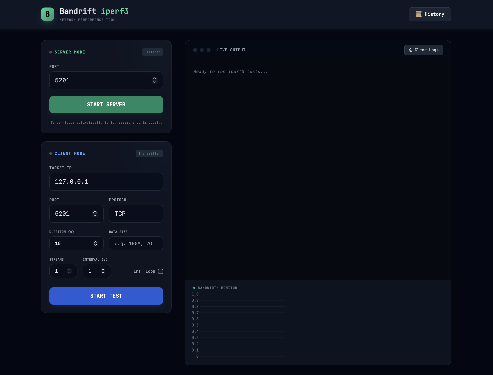

# Bandrift



Bandrift is a modern, cross-platform graphical user interface for network performance measurement, powered by Tauri and iperf3. It allows users to easily set up iperf3 servers and clients, run custom bandwidth tests, and visualize the throughput in real-time.

## Features
* **Cross-Platform:** Runs natively on macOS, Windows, and Linux.
* **Real-time Monitoring:** Visualizes network throughput (Mbits/sec) with an interactive live graph.
* **Advanced Test Options:** Configure protocol (TCP/UDP), parallel streams, test duration, data packet sizes, reporting intervals, and continuous testing modes directly from the app interface.
* **Persistent History:** Automatically saves past test sessions (along with their bandwidth results) to a local SQLite database for easy tracking over time.

## How to Run

### Requirements
- Node.js
- Rust (cargo)

### Development
To run this application locally in development mode:

1. Navigate to the project directory.
2. Install the Node.js dependencies:
   ```bash
   npm install
   ```
3. Start the Tauri development server:
   ```bash
   npm run tauri dev
   ```

*Note on macOS environments: If your system restricts the build and throws an `Operation not permitted` error on the `target` directory, you can bypass it by exporting custom paths:*
```bash
export TMPDIR=$PWD/src-tauri/tmp && export CARGO_TARGET_DIR=$PWD/src-tauri/target_build && npm run tauri dev
```

### Building for Release
To build a standalone, distributable application wrapper for your operating system:
```bash
npm run tauri build
```

## How It Works
Bandrift uses **Tauri** to create a lightweight native window for the frontend (built using HTML, Vanilla Javascript, and TailwindCSS). The backend is written in **Rust**, which communicates directly with OS-specific, pre-compiled `iperf3` binaries. These binaries are bundled inside the app as "sidecars" so that users do not need to install `iperf3` externally on their machine.

When you start a test via the Bandrift interface, the Rust backend seamlessly spawns and manages the `iperf3` process in the background. It intercepts the live command-line output from `iperf3`, parses the bandwidth data, sends it cleanly to the frontend layout via Tauri events, and plots the results on the graph.

## Open Source & Credits
Bandrift is **open source** and completely **free to use**. 

### Special Acknowledgments: iperf3
This application acts as a graphical wrapper and relies entirely on **[iperf3](https://software.es.net/iperf/)** to perform the heavy lifting of network stress-testing and bandwidth measurement. Huge credit and thanks go to ESnet, Lawrence Berkeley National Laboratory, and the incredible developers and contributors of the iperf3 open-source project. 
